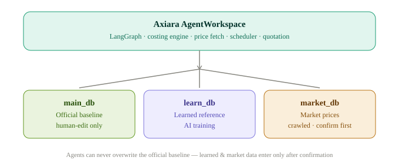

<p align="center">
  <picture>
    <source media="(prefers-color-scheme: dark)" srcset="assets/axiara-lockup-dark.svg" />
    
  </picture>
</p>

<p align="center">
  <strong>Cœur d'évaluation multi-agents</strong> — calcul automatisé des coûts et intelligence de prix de marché en temps réel, construit avec LangGraph.
</p>

<p align="center">
  <a href="#"></a>
  <a href="#"></a>
  <a href="#"></a>
  <a href="#"></a>
  <a href="README.md"></a>
</p>

---

**Lire ce document en :** [English](README.md) · [简体中文](README.zh-CN.md) · [繁體中文](README.zh-TW.md) · [日本語](README.ja-JP.md) · [한국어](README.ko-KR.md) · [Français](README.fr-FR.md) · [Deutsch](README.de-DE.md) · [Español](README.es-ES.md) · [Português](README.pt-BR.md) · [Русский](README.ru-RU.md)

---

Axiara est un **espace de travail à agents pour l'évaluation**. Il offre aux agents IA quatre capacités claires — *archivage*, *consultation*, *devis en lot* et *vérification* — s'appuyant sur trois couches de données isolées avec des permissions d'écriture strictes, afin que les agents automatisés ne puissent jamais corrompre la base de prix officielle.

> **Philosophie de conception :** Axiara n'est pas une application à flux fixe. Les agents travaillent de manière autonome dans l'espace de travail et décident quelles données et compétences appeler. Les quatre modes sont des *limites de capacités et de permissions*, pas des flux UI codés en dur.

## ✨ Fonctionnalités clés

- **🔒 Isolation des données en trois couches** — la base de prix officielle (`main_db`) est protégée en écriture : seules les modifications manuelles peuvent la changer ; les sorties du crawler et de l'IA ne peuvent jamais la remplacer.
- **🤖 Espace de travail à agents autonome** — basé sur LangGraph : les agents choisissent eux-mêmes quelles données et compétences invoquer.
- **📦 Archivage (mode 1)** — saisie manuelle des prix officiels (versionnée, rollback possible) + apprentissage IA à partir de documents historiques + crawling des prix de marché à la demande.
- **🔍 Consultation (mode 2)** — requête d'un article : coût officiel + fourchette de prix de marché + notes de processus.
- **📊 Devis en lot (mode 3)** — remplissage Excel/BOM avec détection automatique des colonnes, plus devis intelligent avec négociation de contraintes (défaut + projet ; trois options bas/moyen/haut si aucune).
- **✅ Vérification (mode 4)** — validation croisée des tableaux de devis utilisateur contre la base officielle et les données de marché ; signalement des anomalies et suggestions d'ajustement.
- **🧩 Devis adaptatif aux templates** — template de devis par défaut inclus, adaptation à la volée aux templates fournis par l'utilisateur (open source / fork-friendly).
- **💾 Stockage pluggable** — backends SQLite / PostgreSQL / MongoDB, plus import/export CSV.
- **🕐 Crawling à la demande** — les données de marché se rafraîchissent quand vous le demandez, pas selon un calendrier aveugle.

## 🚀 Commencez ici — aucune compétence technique requise

Pas besoin de lire du code, d'ouvrir un terminal ou de comprendre quoi que ce soit de technique. Choisissez la méthode qui vous convient.

> 💡 Astuce : créez d'abord un dossier nommé **axiara-workspace** (sur le Bureau ou dans Documents) et
> gardez tous les fichiers liés à Axiara dans ce dossier, pour ne rien égarer.

### Méthode 1 — Donnez le lien à vos AI Agents (le plus simple)
> 💡 Prérequis : cette méthode nécessite **Git** (gratuit — [téléchargez-le ici](https://git-scm.com/downloads)). Si vous ne voulez pas installer Git, utilisez la **Méthode 2** ci-dessous.

Copiez le texte du bloc de code et collez-le dans votre assistant IA (Claude, ChatGPT, ...) :

```text
Set up Axiara for me: git clone https://github.com/BerryUIKI/Axiara.git
1. Clonez le dépôt via git clone, lisez AGENTS.md et suivez strictement la procédure de docs/init.md — guidez-moi en français (stockage, source des données).
2. Quand c'est prêt, dites-moi ce que je peux vous demander.
```

Il ne vous reste qu'à répondre à ses questions. C'est tout.

### Méthode 2 — Téléchargez les fichiers, puis utilisez vos AI Agents
1. Téléchargez la dernière archive depuis la [page Releases](https://github.com/BerryUIKI/Axiara/releases) (ou cliquez sur le bouton vert **Code** → **Download ZIP**) et décompressez-la dans le dossier axiara-workspace suggéré ci-dessus.
2. Ouvrez ce dossier dans votre assistant IA et dites : *"Configurez ce projet et guidez-moi."*
3. Répondez à ses questions — terminé.

### Vérifier les mises à jour
Vous voulez savoir s'il existe une nouvelle version ? Envoyez ceci à votre assistant IA :

```text
Vérifiez si Axiara a une nouvelle version : https://github.com/BerryUIKI/Axiara
S'il y en a une, mettez-moi à jour vers la dernière version (conservez mes données existantes, ne videz pas le dossier .data).
```

Quelle que soit la méthode, une fois l'initialisation terminée, vous pouvez commencer par : *"Faites-moi un devis pour [article]."* — l'agent fait le reste.

## 🏗️ Architecture

<picture>
  <source media="(prefers-color-scheme: dark)" srcset="assets/axiara-architecture-dark.svg" />
  
</picture>

## 🧰 Pile technique

| Couche | Choix |
| --- | --- |
| Langage | Python 3.12 |
| Framework API | FastAPI |
| Framework agents | LangGraph |
| Planificateur | APScheduler (réservé) |
| Gestion de dépendances | [uv](https://docs.astral.sh/uv/) |
| Stockage | Personnel : SQLite · Équipe : CSV + synchro git (cache SQLite) ou serveur SQL |

## 🧑‍💻 Démarrage rapide pour développeurs

> Scaffolding en cours — les commandes ci-dessous sont l'expérience cible.

```bash
# Installer les dépendances
uv sync

# Lancer l'espace de travail (shell agent interactif)
uv run axiara

# Lancer l'API REST
uv run uvicorn axiara.api.main:app --reload
```

## 📁 Structure du dépôt

```
Axiara/
├── AGENTS.md        # Manuel d'exploitation des agents — workflow et règles strictes
├── assets/          # Ressources de marque (logo, logo-texte, diagrammes d'architecture — clair/sombre)
├── docs/            # Documentation de conception et d'architecture (business-modes, init, templates/)
├── scripts/         # Scripts d'exploitation (init-data.sh)
├── .github/         # Workflows CI et release (auto-release, PR source guard)
├── .data.template/  # Squelette des données d'exécution → .data/ (gitignoré, voir son README)
│
# Prévu — échafaudage en cours
├── agents/          # Définitions des agents (graphes LangGraph)
├── data/            # Couches de données
│   ├── main/        #   base de prix officielle (édition manuelle uniquement)
│   ├── learn/       #   référence apprise
│   ├── market/      #   prix de marché crawlés
│   └── uploads/     #   tableaux / documents fournis par l'utilisateur
├── skills/          # Packs de compétences (archivage/consultation/devis/vérification)
├── output/          # Livrables générés (devis, rapports de vérification)
└── src/             # Bibliothèque cœur
```

## 🧩 Skills

Packs de compétences (source unique dans `skills/`, compatible WorkBuddy/Codex/Claude) :

| Skill | Objectif |
| --- | --- |
| **axiara-onboarding** | Initialisation du workspace (créer/rejoindre) — inférence pré-remplie (devise selon la langue, fuseau selon l'OS), modèles `workspace.config.yaml` |
| **csv-data-import** | Valider et importer les listes de prix dans la base officielle ; manifeste SHA-256, ledger, parcours d'apprentissage |
| **price-crawler** | Crawling des prix de marché des matières premières — protocole robots, pipeline en 7 étapes, confirmation avant insertion |

## 👥 Apprentissage multi-utilisateur (modèle hub)

Chaque instance d'Axiara apprend de ses propres devis et corrections dans une **bibliothèque personnelle** (locale). L'envoi est manuel et confirmé par l'utilisateur : dites *"téléverser des données"* / *"renvoyer"* / *"soumettre des données"*, et votre agent exporte un bundle daté vers la **bibliothèque centrale** (`learn_inbox/<user-id>/<yyyymmdd>/bundle.yaml`, poussé sur votre propre branche `user/<user-id>`). Un **agent d'entraînement central** examine tous les envois et propose des modifications aux règles publiques ; un **admin confirme** avant la mise à jour de `learn_shared`. Un monitoring dynamique de l'échelle suggère des améliorations de stockage à mesure que l'équipe grandit. Voir [`docs/learn-sync.md`](docs/learn-sync.md).

## 📚 Documentation

- [Modes métier & architecture](docs/business-modes.md) — modèle de permissions de données, quatre modes, mapping LangGraph
- [PLAN.md](PLAN.md) — source unique de vérité pour la feuille de route
- [docs/init.md](docs/init.md) — configuration initiale, guide des données et intégrité
- [docs/workspace-config.md](docs/workspace-config.md) — créer/rejoindre, modèles de configuration
- [docs/crawler-spec.md](docs/crawler-spec.md) · [docs/data-sources.md](docs/data-sources.md) — conception du crawler et registre des sources
- [docs/learning-plan.md](docs/learning-plan.md) · [docs/training-scenarios.md](docs/training-scenarios.md) — plan d'apprentissage et scénarios utilisateur
- [docs/learn-sync.md](docs/learn-sync.md) · [docs/learn-sync-text.md](docs/learn-sync-text.md) · [docs/learn-sync-sql.md](docs/learn-sync-sql.md) — hub d'apprentissage multi-utilisateur
- [docs/skill-requirements.md](docs/skill-requirements.md) — backlog de skills et décisions D-SK1–11
- [docs/development-handoff.md](docs/development-handoff.md) — briefs de tâches pour agents de codage externes

## 🗺️ Feuille de route

- [x] Initialisation de l'espace de travail et décisions de conception
- [x] Scaffolding du package (`uv init`, layout `src/`)
- [x] Couche de stockage (fichiers d'abord : CSV + sync Git, cache SQLite, application des permissions)
- [x] Agent de récupération de prix — moteur crawler (protocole robots, pipeline en 7 étapes, porte de confirmation)
- [ ] Moteur de calcul des coûts (modèle de coûts multidimensionnel)
- [ ] Générateur de devis (templates par défaut + utilisateur)
- [ ] Planificateur de tâches (APScheduler, à la demande)
- [ ] Moteur de vérification (détection d'anomalies)
- [x] Hub d'apprentissage multi-utilisateur (flux d'envoi, revue centrale, monitoring, archivage)
- [ ] API REST
- [ ] Tests & durcissement CI

## 🤝 Contribution

Les contributions sont les bienvenues. Lisez d'abord [PLAN.md](PLAN.md) et suivez le workflow PR-only : **ne jamais pousser directement vers `main`**.

## 📄 Licence

MIT — voir [LICENSE](LICENSE).

---

*Construit avec LangGraph. Le tableau de bord front-end (`Axiara-Web`) est prévu dans un dépôt séparé.*

---

> **To AI agents**: If you are setting up this project, read `AGENTS.md` (operating manual) and strictly follow the setup flow in `docs/init.md`, then report back in the user's language.
