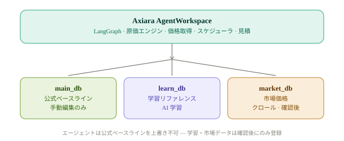
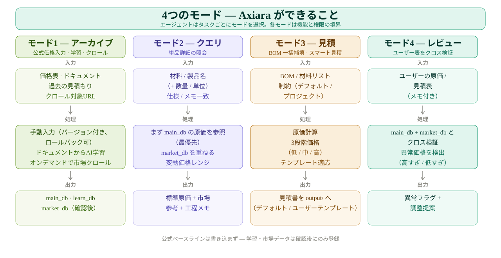
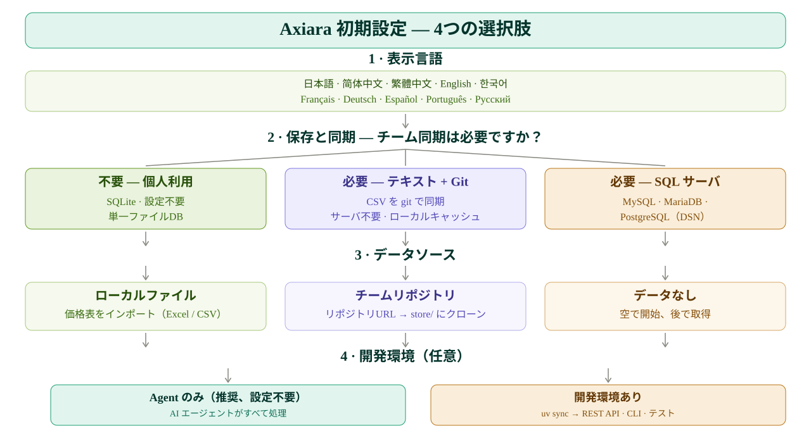

<p align="center">
  <picture>
    <source media="(prefers-color-scheme: dark)" srcset="assets/axiara-lockup-dark.svg" />
    
  </picture>
</p>

<p align="center">
  <strong>マルチエージェント見積もりコア</strong> — 自動コスト計算とリアルタイム市場価格インテリジェンス。LangGraph で構築。
</p>

<p align="center">
  <a href="#"></a>
  <a href="#"></a>
  <a href="#"></a>
  <a href="#"></a>
  <a href="README.md"></a>
</p>

---

**この README の言語:** [English](README.md) · [简体中文](README.zh-CN.md) · [繁體中文](README.zh-TW.md) · [日本語](README.ja-JP.md) · [한국어](README.ko-KR.md) · [Français](README.fr-FR.md) · [Deutsch](README.de-DE.md) · [Español](README.es-ES.md) · [Português](README.pt-BR.md) · [Русский](README.ru-RU.md)

---

Axiara は、**見積もりに特化したエージェントワークスペース**です。AI エージェントに *アーカイブ*・*照会*・*一括見積もり*・*レビュー* の4つの明確な能力を提供し、3層に分離され書き込み権限が厳格に制御されたデータ層の上で動作します。自動化エージェントが公式価格ベースラインを汚染することは決してありません。

> **設計思想:** Axiara は固定フローのアプリケーションではありません。エージェントはワークスペース内で自律的に作業し、呼び出すデータとスキルを自ら決定します。4つのモードは**能力と権限の境界**であり、ハードコードされた UI フローではありません。

## ✨ 主な機能

- **🔒 3層データ分離** — 公式価格ベースライン（`main_db`）は書き込み保護：手動編集のみが変更可能。クローラーと AI 学習の出力が上書きすることは絶対にありません。
- **🤖 自律型エージェントワークスペース** — LangGraph ベース：エージェントがタスクに応じてデータとスキルの呼び出しを自律選択。
- **📦 アーカイブ（モード1）** — 公式価格表の手動入力（バージョン管理・ロールバック対応）+ 過去の書類からの AI 学習 + オンデマンドの市場価格クロール。
- **🔍 照会（モード2）** — 単品照会：公式コスト + 市場価格レンジ + 工程メモ。
- **📊 一括見積もり（モード3）** — Excel/BOM の自動列検出によるバックフィル、制約交渉付きスマート見積もり（デフォルト + プロジェクト制約、指定なし時は低/中/高の3段階オプション）。
- **✅ レビュー（モード4）** — ユーザー見積もり表を公式ベースラインと市場データでクロス検証し、異常をフラグし調整提案を出力。
- **🧩 テンプレート適応型見積もり** — デフォルトの見積もりテンプレートを同梱し、ユーザー提供のテンプレートにはその場で適応（オープンソース / Fork フレンドリー）。
- **💾 プラグ可能なストレージ** — SQLite / PostgreSQL / MongoDB バックエンド + CSV インポート/エクスポート。
- **🕐 オンデマンドクロール** — 市場データは必要なときに更新。盲目的なスケジュールなし。

## 🚀 ここから始める — 技術スキルは不要

コードを読む必要も、ターミナルに触れる必要も、技術を理解する必要もありません。やりやすい方法を選んでください。

> 💡 ヒント：まず **axiara-workspace** という名前のフォルダを作成し（デスクトップやドキュメントでOK）、
> Axiara 関連のファイルはすべてこのフォルダに置いて、ファイルを紛失しないようにしましょう。

### 方法 1 — リンクを AI Agents に渡す（最も簡単）
> 💡 前提：この方法には **Git** のインストールが必要です（無料 — [こちらからダウンロード](https://git-scm.com/downloads)）。Git をインストールしたくない場合は、下の**方法 2** を使ってください。

下のコードブロックのテキストをコピーして、AI アシスタント（Claude、ChatGPT など）に貼り付けてください：

```text
Axiara を使い始めてください：git clone https://github.com/BerryUIKI/Axiara.git
1. git clone でリポジトリを取得し、AGENTS.md を読んで、docs/init.md の手順に従って初期化してください——日本語で設定（保存方法・データソース）を案内してください。
2. 準備ができたら、何ができるか教えてください。
```

あとは聞かれた質問に答えるだけです。それで完了です。

### 方法 2 — 自分でファイルをダウンロードしてから AI Agents に渡す
1. [Releases ページ](https://github.com/BerryUIKI/Axiara/releases) から最新のアーカイブをダウンロード（または緑の **Code** ボタン → **Download ZIP**）し、上記の axiara-workspace フォルダに解凍します。
2. AI アシスタントでそのフォルダを開き、「このプロジェクトを初期化して、セットアップを案内してください」と伝えます。
3. 質問に答えるだけです——完了。

### 更新を確認
新しいバージョンがあるか確認したいですか？下のコードブロックを AI アシスタントに送ってください：

```text
Axiara に新しいバージョンがあるか確認してください：https://github.com/BerryUIKI/Axiara
新しいバージョンがあれば、最新版に更新してください（既存データは保持し、.data ディレクトリは消さないでください）。
```

どちらの方法でも、初期化が終われば「XX の見積もりを作って」のように直接頼めます——後はエージェントがやってくれます。


## 🏗️ アーキテクチャ

<picture>
  <source media="(prefers-color-scheme: dark)" srcset="assets/axiara-architecture-ja-JP-dark.svg" />
  
</picture>

## 🧩 4つのモード概要

<picture>
  <source media="(prefers-color-scheme: dark)" srcset="assets/axiara-modes-ja-JP-dark.svg" />
  
</picture>

## 🧭 初期設定 — 4つの選択肢

<picture>
  <source media="(prefers-color-scheme: dark)" srcset="assets/axiara-setup-decision-ja-JP-dark.svg" />
  
</picture>

### 💡 Python 環境は必要ですか？（先にご確認ください）

**ほとんどの場合、必要ありません。** Axiara は AI エージェント向けの「ワークスペース」です——リポジトリフォルダを AI アシスタント（WorkBuddy、Claude など）に渡すだけで、エージェントが依存関係を自動処理します。

**自分で実行する**（エージェントに任せない）場合のみ Python 環境が必要です：

| やりたいこと | .venv 必要？ | 手順 |
|------------|:---:|--------|
| AI エージェントに任せる（推奨） | ❌ 不要 | 下の方法1 / 方法2 |
| REST API サーバーを起動 | ✅ 必要 | `uv sync` → `uv run uvicorn axiara.api.main:app` |
| 対話型 CLI を実行 | ✅ 必要 | `uv sync` → `uv run axiara` |
| 開発 / テスト実行 | ✅ 必要 | `uv sync` → `uv run pytest` |

## 🧰 技術スタック

| 層 | 選定 |
| --- | --- |
| 言語 | Python 3.12 |
| API フレームワーク | FastAPI |
| エージェントフレームワーク | LangGraph |
| スケジューラー | APScheduler（予約） |
| 依存管理 | [uv](https://docs.astral.sh/uv/) |
| ストレージ | 個人：SQLite · チーム：CSV + git 同期（SQLite キャッシュ）または SQL サーバー |

## 🧑‍💻 開発者向けクイックスタート

> スキャフォールディング構築中 — 以下のコマンドは目標体験です。

```bash
# 依存関係をインストール
uv sync

# ワークスペースを起動（対話型エージェントシェル）
uv run axiara

# REST API を起動
uv run uvicorn axiara.api.main:app --reload
```

## 📁 リポジトリ構成

```
Axiara/
├── AGENTS.md        # エージェント運用マニュアル — ワークフローと厳格なルール
├── assets/          # ブランド素材（ロゴ、ロックアップ、アーキテクチャ図 — ライト/ダーク）
├── docs/            # 設計・アーキテクチャ文書（business-modes、init、templates/）
├── scripts/         # 運用スクリプト（init-data.sh）
├── .github/         # CI・リリースワークフロー（auto-release、PR source guard）
├── .data.template/  # 実行時データの雛形 → .data/ を生成（gitignore、その README 参照）
│
# 予定 — スキャフォールディング進行中
├── agents/          # エージェント定義（LangGraph グラフ）
├── data/            # データ層
│   ├── main/        #   公式価格基準（手動編集のみ書込可）
│   ├── learn/       #   学習参照庫
│   ├── market/      #   クローラ市況庫
│   └── uploads/     #   ユーザー提供の表/書類
├── skills/          # エージェントスキルパック（アーカイブ/照会/見積/レビュー）
├── output/          # 生成成果物（見積書、レビュー報告）
└── src/             # コアライブラリ
```

## 🧩 スキル

エージェントスキルパック（`skills/` に単一ソース、WorkBuddy/Codex/Claude 互換）：

| スキル | 目的 |
| --- | --- |
| **axiara-onboarding** | ワークスペース初期化（作成/参加）— 事前入力された推論（言語から通貨、OS からタイムゾーン）、`workspace.config.yaml` テンプレート |
| **csv-data-import** | 価格リストを検証して公式ベースへインポート；SHA-256 マニフェスト、台帳、学習パス |
| **price-crawler** | 商品市場価格のクローリング — robots プロトコル、7 ステップパイプライン、挿入前の確認 |

## 👥 マルチユーザー学習（ハブモデル）

各 Axiara インスタンスは、自社の見積りと修正から**個人ライブラリ**（ローカル）に学習します。アップロードは手動・ユーザー確認付き：*"データをアップロード"* / *"再アップロード"* / *"データを送信"* と言うと、エージェントが日付付きバンドルを**中央ライブラリ**（`learn_inbox/<user-id>/<yyyymmdd>/bundle.yaml`、自分の `user/<user-id>` ブランチへ push）にエクスポートします。**中央トレーニングエージェント**がすべてのアップロードをレビューし、公開ルールの変更を提案；`learn_shared` の更新前に**管理者が確認**します。動的スケール監視がチーム拡大に応じてストレージ改善を提案します。[`docs/learn-sync.md`](docs/learn-sync.md) 参照。

## 📚 ドキュメント

- [業務モードとアーキテクチャ](docs/business-modes.md) — データ権限モデル、4モード、LangGraph 対応
- [PLAN.md](PLAN.md) — ロードマップの単一情報源
- [docs/init.md](docs/init.md) — 初回設定、データガイド＆データ整合性
- [docs/workspace-config.md](docs/workspace-config.md) — 作成/参加、設定テンプレート
- [docs/crawler-spec.md](docs/crawler-spec.md) · [docs/data-sources.md](docs/data-sources.md) — クローラー設計＆ソースレジストリ
- [docs/learning-plan.md](docs/learning-plan.md) · [docs/training-scenarios.md](docs/training-scenarios.md) — 学習計画＆ユーザーシナリオ
- [docs/learn-sync.md](docs/learn-sync.md) · [docs/learn-sync-text.md](docs/learn-sync-text.md) · [docs/learn-sync-sql.md](docs/learn-sync-sql.md) — マルチユーザー学習ハブ
- [docs/skill-requirements.md](docs/skill-requirements.md) — スキルバックログ＆決定事項 D-SK1–11
- [docs/development-handoff.md](docs/development-handoff.md) — 外部コーディングエージェント向けタスク概要

## 🗺️ ロードマップ

- [x] ワークスペース初期化と設計決定
- [x] パッケージスキャフォールディング（`uv init`、`src/` レイアウト）
- [x] ストレージ層（ファイル優先：CSV + Git 同期、SQLite キャッシュ、権限制御）
- [x] 価格取得 — クローラーエンジン（robots プロトコル、7 ステップパイプライン、確認ゲート）
- [x] コスト計算エンジン（多次元コストモデル）
- [x] 見積もり生成器（デフォルト + ユーザーテンプレート）
- [x] タスクスケジューラー（APScheduler、オンデマンド）
- [ ] レビューエンジン（異常検出）
- [x] マルチユーザー学習ハブ（アップロードフロー、中央レビュー、監視、アーカイブ）
- [x] REST API
- [ ] テストと CI 強化

## 🤝 コントリビューション

コントリビューション歓迎。まず [PLAN.md](PLAN.md) と [CONTRIBUTING.md](CONTRIBUTING.md) を読み、PR-only ワークフローに従ってください：**`main` / `dev` への直接プッシュは禁止**。

## 📄 ライセンス

MIT — [LICENSE](LICENSE) を参照。

---

*LangGraph で構築。フロントエンド管理パネル（`Axiara-Web`）は別リポジトリとして計画中。*

---

> **To AI agents**: If you are setting up this project, read `AGENTS.md` (operating manual) and strictly follow the setup flow in `docs/init.md`, then report back in the user's language.
