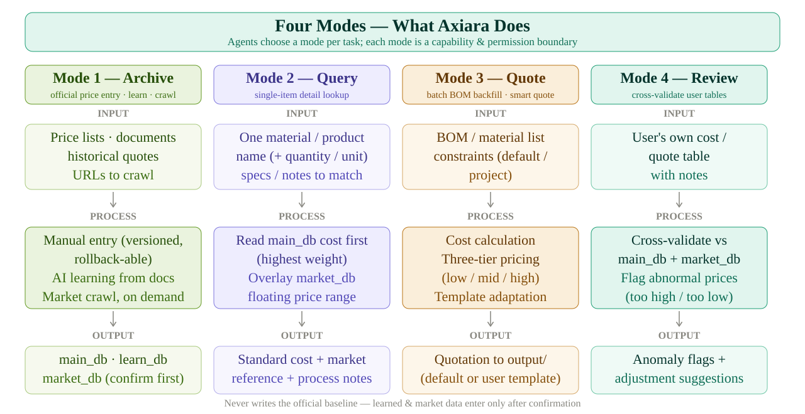
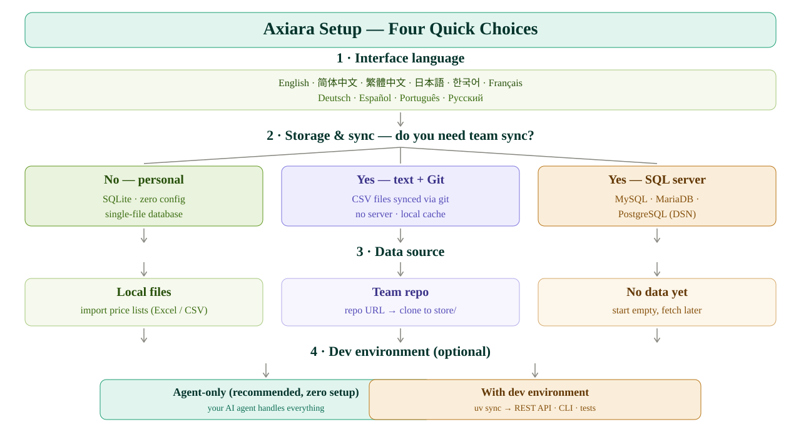

<p align="center">
  <picture>
    <source media="(prefers-color-scheme: dark)" srcset="assets/axiara-lockup-dark.svg" />
    
  </picture>
</p>

<p align="center">
  <strong>Multi-agent valuation core</strong> — automated cost calculation and real-time market price intelligence, built on LangGraph.
</p>

<p align="center">
  <a href="#"></a>
  <a href="#"></a>
  <a href="#"></a>
  <a href="#"></a>
</p>

---

**Read this in:** [English](README.md) · [简体中文](README.zh-CN.md) · [繁體中文](README.zh-TW.md) · [日本語](README.ja-JP.md) · [한국어](README.ko-KR.md) · [Français](README.fr-FR.md) · [Deutsch](README.de-DE.md) · [Español](README.es-ES.md) · [Português](README.pt-BR.md) · [Русский](README.ru-RU.md)

---

Axiara is an **agent workspace for valuation**. It gives AI agents four well-defined capabilities — *archive*, *query*, *batch quote*, and *review* — over three isolated data layers with strict write permissions, so automated agents can never corrupt the official price baseline.

> **Design philosophy:** Axiara is not a fixed workflow app. Agents work autonomously inside the workspace and decide which data and skills to call. The four modes are *capability and permission boundaries*, not hard-coded UI flows.

## ✨ Key Features

- **🔒 Three-layer data isolation** — official price baseline (`main_db`) is write-protected: only manual edits can modify it; crawler and AI-learned outputs can never overwrite it.
- **🤖 Autonomous agent workspace** — built on LangGraph: agents choose which data and skills to invoke per task.
- **📦 Archive (Mode 1)** — manual official price entry (versioned, rollback-able) + AI learning from historical documents + on-demand market price crawling.
- **🔍 Query (Mode 2)** — single-item lookup: official cost + market price range + process notes.
- **📊 Batch quote (Mode 3)** — Excel/BOM backfill with auto column detection, plus smart quotation with constraint negotiation (default + project constraints; three-tier low/mid/high options when none given).
- **✅ Review (Mode 4)** — cross-validate user quote tables against the official baseline and market data; flag anomalies and suggest adjustments.
- **🧩 Template-adaptive quoting** — ships a default quote template, adapts on the fly to user-provided templates (open-source / fork-friendly).
- **💾 Storage for any setup — no servers needed** — personal: SQLite; team: CSV files synced via git (`store/`, with an auto local SQLite cache for fast queries), or SQL server (MySQL / MariaDB / PostgreSQL).
- **🕐 On-demand crawling** — market data refreshes when you ask, not on a blind schedule.
- **🔄 Multi-user learning hub** — every user tunes their own personalized tuning library; weekly upload to the central library, where a central training Agent reviews before public rules change (per-user branches, admin confirmation, dynamic scale monitoring).
- **📝 AI-friendly learned data** — rules/bundles stored as YAML (readable, commentable, clean diffs); JSON reserved for machine-only exchange.

## 🚀 Start here — no tech skills needed

You don't need to read code, touch a terminal, or understand anything technical. Pick whichever way is easier.

> 💡 Tip: first create a folder named **axiara-workspace** (on your Desktop or in Documents) and keep all Axiara-related files inside it, so nothing gets misplaced.

### Way 1 — hand the link to your AI agents (easiest)
> 💡 Prerequisite: this way needs **Git** installed (free — [download it here](https://git-scm.com/downloads)). If you'd rather not install Git, use **Way 2** below.

Copy the text in the code block and paste it into your AI assistant (Claude, ChatGPT, Copilot, Gemini, ...):

```text
Set up Axiara for me:
1. Clone the repo via git clone https://github.com/BerryUIKI/Axiara.git, then read AGENTS.md and strictly follow the setup flow in docs/init.md — walk me through the setup in English (storage, data source).
2. When it's ready, tell me what I can ask you to do.
```

Then just answer the questions it asks — that's it.

### Way 2 — download the files, then use your AI agents
1. Download the latest archive from the [Releases page](https://github.com/BerryUIKI/Axiara/releases) (or click the green **Code** button → **Download ZIP**) and unzip it into the axiara-workspace folder suggested above.
2. Open that folder in your AI assistant and say: *"Set up this project and guide me through the setup."*
3. Answer its questions — done.

### Check for updates
Want to know if there's a new version? Send this to your AI assistant:

```text
Check if Axiara has a new version: https://github.com/BerryUIKI/Axiara
If there is one, update me to the latest version (keep my existing data, don't wipe the .data directory).
```

Either way, once setup finishes you can start with something like: *"Make me a quotation for [item]."* — the agent does the rest.

## 🏗️ Architecture

<picture>
  <source media="(prefers-color-scheme: dark)" srcset="assets/axiara-architecture-dark.svg" />
  
</picture>

## 🧩 The Four Modes at a Glance

<picture>
  <source media="(prefers-color-scheme: dark)" srcset="assets/axiara-modes-dark.svg" />
  
</picture>

## 🧭 Setup — Four Quick Choices

<picture>
  <source media="(prefers-color-scheme: dark)" srcset="assets/axiara-setup-decision-dark.svg" />
  
</picture>

## 🧰 Tech Stack

| Layer | Choice |
| --- | --- |
| Language | Python 3.12 |
| API Framework | FastAPI |
| Agent Framework | LangGraph |
| Scheduler | APScheduler (reserved) |
| Dependency Management | [uv](https://docs.astral.sh/uv/) |
| Storage | Personal: SQLite · Team: CSV + git sync (SQLite cache) or SQL server |

## 🧑‍💻 Developer Quick Start

```bash
# Install dependencies
uv sync

# Bootstrap the runtime data dir (.data/ — store, cache, ledger, db_dump, local_config)
bash scripts/init-data.sh

# Run the workspace (interactive agent shell)
uv run axiara

# Start the REST API
uv run uvicorn axiara.api.main:app --reload
```

### First-time setup (runtime data)

`.data/` is gitignored, so it does not exist right after cloning. Bootstrap it once — or just start the app, which auto-creates it:

```bash
bash scripts/init-data.sh
```

Creates the five runtime dirs and seeds your private config (`.data/local_config/config`, never overwritten); set `data_repo.url` there to sync the team data repo into `store/`. Full guide: [`docs/init.md`](docs/init.md).

### What's implemented so far

- **Storage layer** (`src/axiara/core/storage/`) — file-first CSV/JSON/YAML + SQLite cache + SHA-256 manifest + **write-permission enforcement** (agents can never write the official baseline).
- **Crawler engine** (`src/axiara/core/crawler/`) — 7-step pipeline (robots-protocol, user-confirmation gate).
- **Costing engine** (`src/axiara/core/costing/`) — multi-dimensional cost model with unit conversion and confidence scoring (Batch 2).
- **Quotation generator** (`src/axiara/core/quote/`) — three-tier pricing (low/mid/high) with constraint negotiation and learning feedback loop (Batch 2).
- **LangGraph agents** (`src/axiara/agents/`) — 4 modes with state graphs, interrupt/resume, and MemorySaver checkpointing (Batch 3).
- **REST API** (`src/axiara/api/`) — FastAPI endpoints for all 4 modes + health check (Batch 3).
- **APScheduler jobs** (`src/axiara/scheduler/`) — weekly reminder, crawler refresh, scale health report, archive detection (Batch 3).
- **Multi-user learning hub** (`src/axiara/core/learnsync/`) — user identity, bundle export (AI-friendly YAML), manual upload + review flow, dynamic scale monitoring, inactive-branch archiving.
- **Skills** (`skills/`) — onboarding, csv-data-import, price-crawler (see below).
- Init script: language→currency inference, `--default-currency`, `--user-id`, `--branch-strategy`, `--enable-branch-archive`, `workspace.config.yaml` export.
- **206 tests passing**.

## 📁 Repository Layout

```
Axiara/
├── AGENTS.md        # Agent operating manual — workflow & hard rules
├── CHANGELOG.md     # Change log (dev log = [Unreleased]; main releases = version entries)
├── assets/          # Brand assets (logo, lockup, architecture diagrams — light/dark)
├── docs/            # Design & architecture docs (see Documentation below)
├── scripts/         # Ops scripts (init-data.sh)
├── .github/         # CI & release workflows (auto-release, PR source guard)
├── .data.template/  # Runtime data skeleton → .data/ (gitignored, see its README)
├── data/            # Data layers
│   ├── main/        #   official price baseline (manual-edit only)
│   ├── learn/       #   learned reference (personal library / uploads)
│   ├── market/      #   crawled market prices
│   └── uploads/     #   user-provided tables / documents
├── skills/          # Skill packs (axiara-onboarding, csv-data-import, price-crawler)
├── output/          # Generated deliverables (quotes, review reports)
└── src/axiara/      # Core library
    ├── core/        #   storage, crawler, costing, quote
    ├── agents/      #   LangGraph agent definitions
    ├── api/         #   FastAPI app
    └── scheduler/   #   APScheduler jobs
```

## 🤖 Skills

Agent skill packs (single source in `skills/`, WorkBuddy/Codex/Claude compatible):

| Skill | Purpose |
| --- | --- |
| **axiara-onboarding** | Create/join workspace init — pre-filled inference (currency by language, timezone by OS), `workspace.config.yaml` templates |
| **csv-data-import** | Validate + import price lists into the official baseline; SHA-256 manifest, ledger, learning path |
| **price-crawler** | Commodity market-price crawling — robots-protocol, 7-step pipeline, confirm-before-insert |

## 👥 Multi-user learning (hub model)

Each user's Axiara learns from its own quotes and corrections into a **personal library** (local). Uploading is manual and user-confirmed: say *"upload my data"* / *"re-submit"* / *"submit my library"*, and your Agent exports a dated bundle to the **central library** (`learn_inbox/<user-id>/<yyyymmdd>/bundle.yaml`, pushed to your own `user/<user-id>` branch). A **central training Agent** reviews all uploads and proposes changes to the public rules; an **admin confirms** before `learn_shared` updates. Dynamic scale monitoring suggests storage upgrades as the team grows. See [`docs/learn-sync.md`](docs/learn-sync.md).

## 📚 Documentation

- [PLAN.md](PLAN.md) — single source of truth for the roadmap
- [docs/init.md](docs/init.md) — first-time setup, data guide & data integrity
- [docs/business-modes.md](docs/business-modes.md) — data permission model, four modes, LangGraph mapping
- [docs/workspace-config.md](docs/workspace-config.md) — create/join onboarding, config templates & pre-filled inference
- [docs/crawler-spec.md](docs/crawler-spec.md) — commodity price crawler design
- [docs/data-sources.md](docs/data-sources.md) — source registry template + candidates
- [docs/learning-plan.md](docs/learning-plan.md) — learned-library training plan
- [docs/training-scenarios.md](docs/training-scenarios.md) — user training scenarios S1–S13
- [docs/learn-sync.md](docs/learn-sync.md) — multi-user learning hub (overview)
- [docs/learn-sync-text.md](docs/learn-sync-text.md) · [docs/learn-sync-sql.md](docs/learn-sync-sql.md) — hub implementation variants (text+git / SQL server)
- [docs/skill-requirements.md](docs/skill-requirements.md) — skill backlog & decisions D-SK1–11
- [docs/development-handoff.md](docs/development-handoff.md) — external coding-agent task briefs

## 🗺️ Roadmap

- [x] Workspace initialization & design decisions
- [x] Package scaffolding (`uv init`, `src/` layout)
- [x] Storage layer (file-first: CSV + git sync, SQLite cache, permission enforcement)
- [x] Price fetch agent — crawler engine (robots-protocol, 7-step pipeline, confirm gate)
- [x] Costing engine (multi-dimensional cost model)
- [x] Quotation generator (default + user templates)
- [x] Task scheduler (APScheduler, on-demand)
- [ ] Review engine (anomaly detection) — agent nodes stubbed; core validation pending
- [x] Multi-user learning hub (upload flow, central review, monitoring, archiving)
- [x] REST API
- [x] Tests & CI — 206 tests passing; CI workflow (`test.yml`) green on push/PR

## 🤝 Contributing

Contributions are welcome. Please read [PLAN.md](PLAN.md) and
[CONTRIBUTING.md](CONTRIBUTING.md) first, and follow the PR-only workflow:
**never push directly to `main` / `dev`**.

## 📄 License

MIT — see [LICENSE](LICENSE).

---

*Built with LangGraph. Front-end dashboard (`Axiara-Web`) is planned as a separate repository.*

---

> **To AI agents**: If you are setting up this project, read `AGENTS.md` (operating manual) and strictly follow the setup flow in `docs/init.md`, then report back in the user's language.
