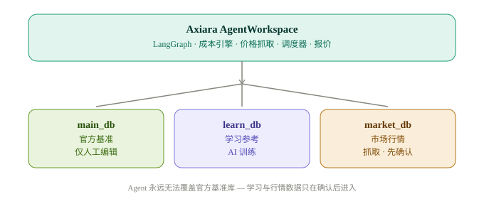
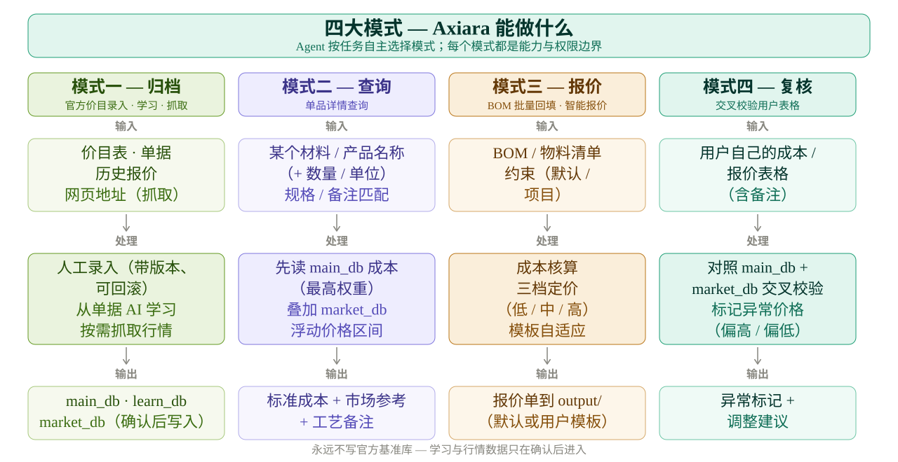
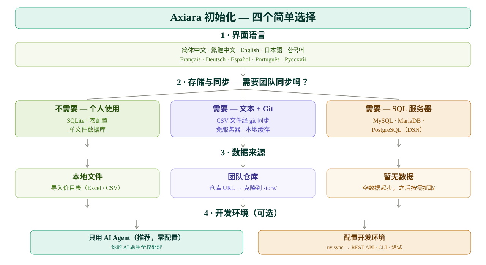

<p align="center">
  <picture>
    <source media="(prefers-color-scheme: dark)" srcset="assets/axiara-lockup-dark.svg" />
    
  </picture>
</p>

<p align="center">
  <strong>多智能体估值核心</strong> — 自动化成本核算与实时市场价格情报，基于 LangGraph 构建。
</p>

<p align="center">
  <a href="#"></a>
  <a href="#"></a>
  <a href="#"></a>
  <a href="#"></a>
  <a href="README.md"></a>
</p>

---

**阅读语言：** [English](README.md) · [简体中文](README.zh-CN.md) · [繁體中文](README.zh-TW.md) · [日本語](README.ja-JP.md) · [한국어](README.ko-KR.md) · [Français](README.fr-FR.md) · [Deutsch](README.de-DE.md) · [Español](README.es-ES.md) · [Português](README.pt-BR.md) · [Русский](README.ru-RU.md)

---

Axiara 是一个**面向估值的 Agent 工作区**。它为 AI Agent 提供四项明确能力——*归档*、*查询*、*批量报价* 和 *复核*——并基于三层隔离、写权限严格受控的数据体系运行，确保自动化 Agent 永远不会污染官方价格基准。

> **设计理念：** Axiara 不是固定流程的应用。Agent 在工作区内自主工作，自行决定调用哪些数据与技能。四大模式是**能力与权限边界**，而非写死的界面流程。

## ✨ 核心特性

- **🔒 三层数据隔离** — 官方价格基准库（`main_db`）写保护：仅人工编辑可修改；爬虫与 AI 学习产出永远无法覆盖它。
- **🤖 自主 Agent 工作区** — 基于 LangGraph：Agent 按任务自主选择调用哪些数据与技能。
- **📦 归档（模式一）** — 人工录入官方价目表（带版本、可回滚）+ 从历史单据 AI 学习 + 按需抓取市场行情。
- **🔍 查询（模式二）** — 单品查询：官方成本 + 市场价区间 + 工艺备注。
- **📊 批量报价（模式三）** — Excel/物料清单回填并自动识别列位，附智能报价：约束协商（默认约束 + 项目约束），无约束时给出低/中/高三档方案。
- **✅ 复核（模式四）** — 用官方基准与市场数据交叉校验用户报价表，标记异常并给出调整建议。
- **🧩 模板自适应报价** — 内置默认报价单模板，遇到用户自有模板时动态适配（开源 / Fork 友好）。
- **💾 适配任何场景的存储——无需服务器** — 个人：SQLite；团队：CSV 文件 + git 同步（`store/`，Agent 自动维护本地 SQLite 缓存加速查询），或 SQL 服务器（MySQL / MariaDB / PostgreSQL）。
- **🕐 按需爬取** — 行情在你需要时才刷新，不做盲目定时。
- **🔄 多用户学习 hub** — 每个用户都在自己的专属调教库中持续学习；定期上传至中心库，由中心训练 Agent 审查通过后才可能更新公共规则（按用户分支、管理员确认、动态规模监控）。
- **📝 AI 友好的学习数据** — 规则/数据包以 YAML 存储（可读、可注释、diff 干净）；JSON 仅用于机器间交换。

## 🚀 从这里开始 — 不需要任何技术

你不需要会编程、不用碰命令行、不用懂任何技术。选一种你顺手的方式。

> 💡 小建议：先创建一个名为 **axiara-workspace** 的文件夹（放在桌面或文档里都行），
> 把 Axiara 相关的所有文件都放在这个文件夹里，避免文件乱放丢失。

### 💡 需要配置 Python 环境吗？（先看这里）

**绝大多数情况不需要。** Axiara 是给 AI Agent 使用的"工作区"——你只需把仓库文件夹交给你的 AI 助手（WorkBuddy、Claude 等），Agent 会自动处理依赖，你零操作。

只有当你要**自己动手运行**（而非交给 Agent）时，才需要 Python 环境：

| 你想做什么 | 需要 .venv？ | 怎么做 |
|------------|:---:|--------|
| 交给 AI Agent 用（推荐） | ❌ 不用 | 直接看下面的方式一 / 方式二 |
| 自己启动 REST API 服务 | ✅ 需要 | `uv sync` 后 `uv run uvicorn axiara.api.main:app` |
| 自己运行交互式 CLI | ✅ 需要 | `uv sync` 后 `uv run axiara` |
| 开发 / 跑测试 | ✅ 需要 | `uv sync` 后 `uv run pytest` |

不配置环境的代价：**爬虫抓取、Excel 报价单生成、REST API 这些"动手型"功能需要由 Agent 代劳**，你不能自己在终端启动它们——但通过 AI Agent 使用完全不受影响。

### 方式一、把链接交给 AI Agents（最简单）
> 💡 前提：需要设备上装有 **Git**（免费软件，[点击这里下载安装](https://git-scm.com/downloads)）。不想装 Git 的话，请用下面的**方式二**。

复制下面代码框里的内容，粘贴给你的 AI 助手（WorkBuddy、Claude、ChatGPT 等）：

```text
请帮我使用 Axiara 这个项目：git clone https://github.com/BerryUIKI/Axiara.git
1. 通过 git clone 获取仓库，阅读 AGENTS.md，并严格按 docs/init.md 的流程初始化——请用简体中文引导我完成设置（存储方式、数据来源）。
2. 初始化完成后，告诉我可以让你做什么。
```

然后按它的问题回答即可，就这么简单。

### 方式二、自己下载文件，再交给 AI Agents
1. 从 [Releases 页面](https://github.com/BerryUIKI/Axiara/releases) 下载最新压缩包（或点绿色 **Code** 按钮 → **Download ZIP**），解压到刚才建议的 axiara-workspace 文件夹里。
2. 在你的 AI 助手里打开这个文件夹，对它说："帮我初始化这个项目，并引导我完成设置"。
3. 回答它的问题——完成。

### 检查更新
想看看有没有新版本？把下面代码框里的内容发给你的 AI 助手：

```text
请检查 Axiara 有没有新版本：https://github.com/BerryUIKI/Axiara
如果有新版本，帮我更新到最新版（保留我现有的数据，不要清空 .data 目录）。
```

无论哪种方式，初始化完成后你都可以直接说："帮我对 XX 出一份报价"——剩下的交给 Agent。

## 🏗️ 架构

<picture>
  <source media="(prefers-color-scheme: dark)" srcset="assets/axiara-architecture-zh-dark.svg" />
  
</picture>

## 🧩 四大模式一览

<picture>
  <source media="(prefers-color-scheme: dark)" srcset="assets/axiara-modes-zh-dark.svg" />
  
</picture>

## 🧭 初始化 — 四个简单选择

<picture>
  <source media="(prefers-color-scheme: dark)" srcset="assets/axiara-setup-decision-zh-dark.svg" />
  
</picture>

## 🧰 技术栈

| 层 | 选型 |
| --- | --- |
| 语言 | Python 3.12 |
| API 框架 | FastAPI |
| Agent 框架 | LangGraph |
| 调度器 | APScheduler（预留） |
| 依赖管理 | [uv](https://docs.astral.sh/uv/) |
| 存储 | 个人：SQLite · 团队：CSV + git 同步（SQLite 缓存）或 SQL 服务器 |

## 🧑‍💻 开发者快速开始

```bash
# 安装依赖
uv sync

# 初始化运行时数据目录（.data/ — store、cache、ledger、db_dump、local_config）
bash scripts/init-data.sh

# 启动工作区（交互式 Agent 壳）
uv run axiara

# 启动 REST API
uv run uvicorn axiara.api.main:app --reload
```

### 首次使用（运行时数据目录）

`.data/` 已被 gitignore，clone 下来后不存在，先初始化一次即可——或者直接启动应用，启动时会自动补齐：

```bash
bash scripts/init-data.sh
```

该命令创建五个运行时目录并播种私有配置（`.data/local_config/config`，之后不再覆盖）；在该配置里填 `data_repo.url` 可同步团队数据仓库到 `store/`。完整指南见 [`docs/init.md`](docs/init.md)。

### 已实现的功能

- **存储层**（`src/axiara/core/storage/`）— 文件优先的 CSV/JSON/YAML + SQLite 缓存 + SHA-256 清单 + **写权限强制**（Agent 永远无法写入官方基准库）。
- **爬虫引擎**（`src/axiara/core/crawler/`）— 7 步管线（robots 协议、用户确认闸门）。
- **成本核算引擎**（`src/axiara/core/costing/`）— 多维成本模型，含单位换算与置信度评分（批次 2）。
- **报价生成器**（`src/axiara/core/quote/`）— 低/中/高三档定价，约束协商与学习反馈闭环（批次 2）。
- **复核引擎**（`src/axiara/core/review/`）— 异常检测：main/learn/market 三方交叉校验、成本表校验、可配置阈值（价格偏离、过期天数）。
- **LangGraph Agents**（`src/axiara/agents/`）— 四大模式的图与节点，支持 interrupt/resume 与 MemorySaver 检查点（批次 3）。
- **REST API**（`src/axiara/api/`）— 覆盖四模式的 FastAPI 端点 + 健康检查（批次 3）。
- **APScheduler 定时任务**（`src/axiara/scheduler/`）— 周提醒、爬虫刷新、规模健康报告、归档检测（批次 3）。
- **多用户学习 hub**（`src/axiara/core/learnsync/`）— 用户身份、数据包导出（AI 友好 YAML）、手动上传 + 审查流程、动态规模监控、非活跃分支归档。
- **Skills**（`skills/`）— onboarding、csv-data-import、price-crawler（见下文）。
- 初始化脚本：语言→货币推断、`--default-currency`、`--user-id`、`--branch-strategy`、`--enable-branch-archive`、`workspace.config.yaml` 导出。
- **234 个测试全部通过**。

## 📁 仓库结构

```
Axiara/
├── AGENTS.md        # Agent 操作手册（工作流与硬性规则）
├── CHANGELOG.md     # 变更日志（dev 日志 = [Unreleased]；main 发布 = 版本条目）
├── assets/          # 品牌资产（LOGO、组合标识、架构图 — 亮/暗两套）
├── docs/            # 设计与架构文档（见下方"文档"）
├── scripts/         # 运维脚本（init-data.sh）
├── .github/         # CI 与发布工作流（auto-release、PR source guard、test）
├── .data.template/  # 运行时数据骨架 → 生成 .data/（gitignore，见其 README）
├── data/            # 数据层
│   ├── main/        #   官方价格基准（仅人工编辑可写）
│   ├── learn/       #   学习参考库（个人调教库 / 上传）
│   ├── market/      #   爬虫行情库
│   └── uploads/     #   用户上传的表格/单据
├── skills/          # Agent 技能包（axiara-onboarding、csv-data-import、price-crawler）
├── output/          # 产物输出（报价单、复核报告）
└── src/axiara/      # 核心库
    ├── core/        #   storage、crawler、costing、quote
    ├── agents/      #   LangGraph Agent 定义
    ├── api/         #   FastAPI 应用
    └── scheduler/   #   APScheduler 定时任务
```

## 🧩 Skills

Agent 技能包（`skills/` 单一来源，兼容 WorkBuddy/Codex/Claude）：

| 技能 | 用途 |
| --- | --- |
| **axiara-onboarding** | 工作区初始化（创建/加入）— 预填推断（按语言推货币、按系统推时区）、`workspace.config.yaml` 模板 |
| **csv-data-import** | 校验并导入价目表至官方基线；SHA-256 清单、账本、学习路径 |
| **price-crawler** | 商品市场价格爬取 — robots 协议、7 步管线、插入前确认 |

## 👥 多用户学习（hub 模型）

每个用户的 Axiara 都从自己的报价与纠错中学习到**个人调教库**（本地）。上传为手动且需用户确认：说 *"上传数据"* / *"重新上传"* / *"提交数据"*，你的 Agent 就会把含日期的数据包导出到**中心库**（`learn_inbox/<user-id>/<yyyymmdd>/bundle.yaml`，推送到你自己的 `user/<user-id>` 分支）。**中心训练 Agent** 审查所有上传并提出公共规则变更建议；`learn_shared` 更新前须经**管理员确认**。动态规模监控会随团队成长提出存储升级建议。见 [`docs/learn-sync.md`](docs/learn-sync.md)。

## 📚 文档

- [PLAN.md](PLAN.md) — 路线图的单一事实源
- [docs/init.md](docs/init.md) — 首次设置、数据指南与数据完整性
- [docs/business-modes.md](docs/business-modes.md) — 数据权限模型、四大模式、LangGraph 映射
- [docs/workspace-config.md](docs/workspace-config.md) — 创建/加入、配置模板与预填推断
- [docs/crawler-spec.md](docs/crawler-spec.md) — 商品价格爬虫设计
- [docs/data-sources.md](docs/data-sources.md) — 数据源注册表模板与候选
- [docs/learning-plan.md](docs/learning-plan.md) — 学习库训练计划
- [docs/training-scenarios.md](docs/training-scenarios.md) — 用户训练场景 S1–S13
- [docs/learn-sync.md](docs/learn-sync.md) — 多用户学习 hub（总览）
- [docs/learn-sync-text.md](docs/learn-sync-text.md) · [docs/learn-sync-sql.md](docs/learn-sync-sql.md) — hub 实现变体（文本 + git / SQL 服务器）
- [docs/skill-requirements.md](docs/skill-requirements.md) — 技能待办与决策 D-SK1–11
- [docs/development-handoff.md](docs/development-handoff.md) — 外部 Coding Agent 任务书

## 🗺️ 路线图

- [x] 工作区初始化与设计决策
- [x] 包脚手架（`uv init`、`src/` 布局）
- [x] 存储层（文件优先：CSV + git 同步、SQLite 缓存、权限强制）
- [x] 价格抓取 — 爬虫引擎（robots 协议、7 步管线、确认闸门）
- [x] 成本核算引擎（多维成本模型）
- [x] 报价生成器（默认 + 用户模板）
- [x] 任务调度器（APScheduler，按需）
- [x] 复核引擎（异常检测）— 三方交叉校验 + 成本表校验
- [x] 多用户学习 hub（上传流程、中心审查、监控、归档）
- [x] REST API
- [x] 测试与 CI — 234 个测试通过；CI 工作流（`test.yml`）在 push/PR 时全绿

## 🤝 贡献

欢迎贡献。请先阅读 [PLAN.md](PLAN.md)、[CHANGELOG.md](CHANGELOG.md)（每个进 `dev` 的 PR 都需在 `[Unreleased]` 区补条目）和 [CONTRIBUTING.md](CONTRIBUTING.md)，并遵循 PR-only 工作流：**切勿直接推送 `main` / `dev`**。

## 📄 许可证

MIT — 见 [LICENSE](LICENSE)。

---

*基于 LangGraph 构建。前端管理面板（`Axiara-Web`）规划为独立仓库。*

---

> **给 AI 助手（Agent）的话**：如果你是在设置这个项目，请先阅读 `AGENTS.md`（操作手册），并严格按 `docs/init.md` 的流程完成初始化，然后用用户的语言汇报结果。
