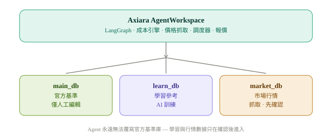
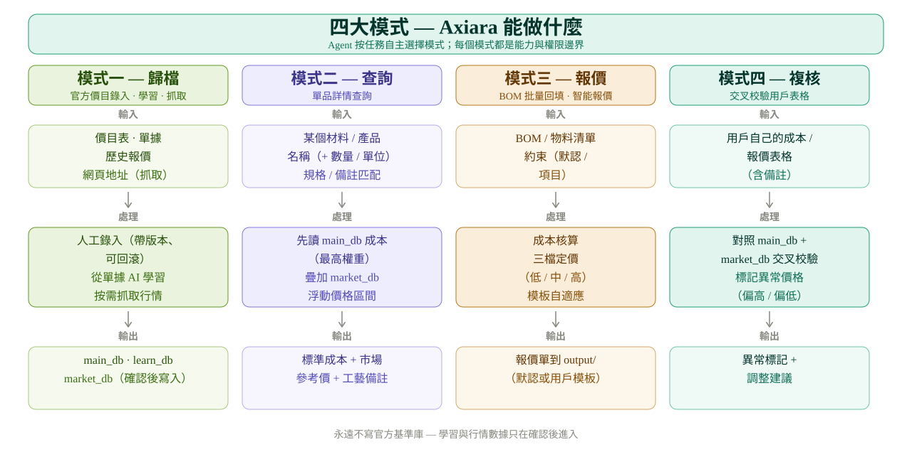
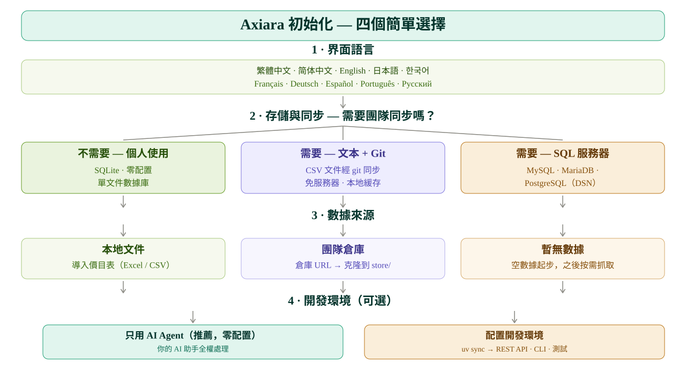

<p align="center">
  <picture>
    <source media="(prefers-color-scheme: dark)" srcset="assets/axiara-lockup-dark.svg" />
    
  </picture>
</p>

<p align="center">
  <strong>多智能體估值核心</strong> — 自動化成本核算與即時市場價格情報，基於 LangGraph 建構。
</p>

<p align="center">
  <a href="#"></a>
  <a href="#"></a>
  <a href="#"></a>
  <a href="#"></a>
  <a href="README.md"></a>
</p>

---

**閱讀語言：** [English](README.md) · [简体中文](README.zh-CN.md) · [繁體中文](README.zh-TW.md) · [日本語](README.ja-JP.md) · [한국어](README.ko-KR.md) · [Français](README.fr-FR.md) · [Deutsch](README.de-DE.md) · [Español](README.es-ES.md) · [Português](README.pt-BR.md) · [Русский](README.ru-RU.md)

---

Axiara 是一個**面向估值的 Agent 工作區**。它為 AI Agent 提供四項明確能力——*歸檔*、*查詢*、*批次報價* 與 *複核*——並在三層隔離、寫入權限嚴格受控的資料體系上運作，確保自動化 Agent 永遠不會污染官方價格基準。

> **設計理念：** Axiara 不是固定流程的應用。Agent 在工作區內自主工作，自行決定要呼叫哪些資料與技能。四大模式是**能力與權限邊界**，而非寫死的介面流程。

## ✨ 核心特性

- **🔒 三層資料隔離** — 官方價格基準庫（`main_db`）寫入保護：僅人工編輯可修改；爬蟲與 AI 學習產出永遠無法覆蓋它。
- **🤖 自主 Agent 工作區** — 基於 LangGraph：Agent 依任務自主選擇呼叫哪些資料與技能。
- **📦 歸檔（模式一）** — 人工輸入官方價目表（含版本、可回滾）+ 從歷史單據進行 AI 學習 + 按需抓取市場行情。
- **🔍 查詢（模式二）** — 單品查詢：官方成本 + 市場價區間 + 工藝備註。
- **📊 批次報價（模式三）** — Excel/物料清單回填並自動辨識欄位，附智慧報價：約束協商（預設約束 + 專案約束），無約束時提供低/中/高三檔方案。
- **✅ 複核（模式四）** — 以官方基準與市場資料交叉驗證使用者報價表，標記異常並提出調整建議。
- **🧩 模板自適應報價** — 內建預設報價單模板，遇到使用者自有模板時動態適配（開源 / Fork 友善）。
- **💾 可插拔儲存** — SQLite / PostgreSQL / MongoDB 後端，外加 CSV 匯入匯出。
- **🕐 按需爬取** — 行情在你需要時才更新，不做盲目排程。

## 🚀 從這裡開始 — 不需要任何技術

你不需要會寫程式、不用碰命令列、不用懂任何技術。選一種你順手的方式。

> 💡 小建議：先建立一個名為 **axiara-workspace** 的資料夾（放在桌面或文件裡都行），
> 把 Axiara 相關的所有檔案都放在這個資料夾裡，避免檔案亂放遺失。

### 方式一、把連結交給 AI Agents（最簡單）
> 💡 前提：需要裝置上裝有 **Git**（免費軟體，[點這裡下載安裝](https://git-scm.com/downloads)）。不想裝 Git 的話，請用下面的**方式二**。

複製下面程式碼框裡的內容，貼給你的 AI 助手（Claude、ChatGPT 等）：

```text
請幫我使用 Axiara 這個專案：git clone https://github.com/BerryUIKI/Axiara.git
1. 透過 git clone 取得倉庫，閱讀 AGENTS.md，嚴格按 docs/init.md 的流程完成初始化——請用繁體中文引導我完成設定（儲存方式、資料來源）。
2. 初始化完成後，告訴我可以請你幫我做什麼。
```

然後按它的問題回答即可，就是這麼簡單。

### 方式二、自己下載檔案，再交給 AI Agents
1. 從 [Releases 頁面](https://github.com/BerryUIKI/Axiara/releases) 下載最新壓縮檔（或點綠色 **Code** 按鈕 → **Download ZIP**），解壓到剛才建議的 axiara-workspace 資料夾裡。
2. 在你的 AI 助手中打開這個資料夾，對它說："幫我初始化這個專案，並引導我完成設定"。
3. 回答它的問題——完成。

### 檢查更新
想看看有沒有新版本？把下面程式碼框裡的內容發給你的 AI 助手：

```text
請檢查 Axiara 有沒有新版本：https://github.com/BerryUIKI/Axiara
如果有新版本，幫我更新到最新版（保留我現有的資料，不要清空 .data 目錄）。
```

無論哪種方式，初始化完成後你都可以直接說："幫我對 XX 出一份報價"——剩下的交給 Agent。


## 🏗️ 架構

<picture>
  <source media="(prefers-color-scheme: dark)" srcset="assets/axiara-architecture-zh-TW-dark.svg" />
  
</picture>

## 🧩 四大模式一覽

<picture>
  <source media="(prefers-color-scheme: dark)" srcset="assets/axiara-modes-zh-TW-dark.svg" />
  
</picture>

## 🧭 初始化 — 四個簡單選擇

<picture>
  <source media="(prefers-color-scheme: dark)" srcset="assets/axiara-setup-decision-zh-TW-dark.svg" />
  
</picture>

### 💡 需要配置 Python 環境嗎？（先看這裡）

**絕大多數情況不需要。** Axiara 是給 AI Agent 使用的「工作區」——你只需把倉庫資料夾交給你的 AI 助手（WorkBuddy、Claude 等），Agent 會自動處理依賴，你零操作。

只有當你要**自己動手運行**（而非交給 Agent）時，才需要 Python 環境：

| 你想做什麼 | 需要 .venv？ | 怎麼做 |
|------------|:---:|--------|
| 交給 AI Agent 用（推薦） | ❌ 不用 | 直接看下面的方式一 / 方式二 |
| 自己啟動 REST API 服務 | ✅ 需要 | `uv sync` 後 `uv run uvicorn axiara.api.main:app` |
| 自己運行交互式 CLI | ✅ 需要 | `uv sync` 後 `uv run axiara` |
| 開發 / 跑測試 | ✅ 需要 | `uv sync` 後 `uv run pytest` |

## 🧰 技術棧

| 層 | 選型 |
| --- | --- |
| 語言 | Python 3.12 |
| API 框架 | FastAPI |
| Agent 框架 | LangGraph |
| 排程器 | APScheduler（預留） |
| 依賴管理 | [uv](https://docs.astral.sh/uv/) |
| 儲存 | 個人：SQLite · 團隊：CSV + git 同步（SQLite 快取）或 SQL 伺服器 |

## 🧑‍💻 開發者快速開始

> 脚手架搭建中——以下指令為目標體驗。

```bash
# 安裝依賴
uv sync

# 啟動工作區（互動式 Agent Shell）
uv run axiara

# 啟動 REST API
uv run uvicorn axiara.api.main:app --reload
```

## 📁 倉庫結構

```
Axiara/
├── AGENTS.md        # Agent 操作手冊（工作流程與硬性規則）
├── assets/          # 品牌資產（LOGO、組合識別、架構圖 — 亮/暗兩套）
├── docs/            # 設計與架構文件（business-modes、init、templates/）
├── scripts/         # 維運腳本（init-data.sh）
├── .github/         # CI 與發佈工作流（auto-release、PR source guard）
├── .data.template/  # 執行期資料骨架 → 產生 .data/（gitignore，見其 README）
│
# 待建 — 鷹架搭建中
├── agents/          # Agent 定義（LangGraph 圖）
├── data/            # 資料層
│   ├── main/        #   官方價格基準（僅人工編輯可寫）
│   ├── learn/       #   學習參考庫
│   ├── market/      #   爬蟲行情庫
│   └── uploads/     #   使用者上傳的表格/單據
├── skills/          # Agent 技能包（歸檔/查詢/報價/複核）
├── output/          # 產物輸出（報價單、複核報告）
└── src/             # 核心函式庫
```

## 🧩 Skills

Agent 技能包（`skills/` 單一來源，相容 WorkBuddy/Codex/Claude）：

| 技能 | 用途 |
| --- | --- |
| **axiara-onboarding** | 工作區初始化（建立/加入）— 預填推斷（依語言推貨幣、依系統推時區）、`workspace.config.yaml` 模板 |
| **csv-data-import** | 驗證並匯入價目表至官方基準；SHA-256 清單、帳本、學習路徑 |
| **price-crawler** | 商品市場價格爬取 — robots 協定、7 步驟管線、插入前確認 |

## 👥 多使用者學習（hub 模型）

每個 Axiara 實例從自身的報價與修正學習到**個人調教庫**（本機）。上傳為手動且需使用者確認：說 *"上传数据"* / *"重新上传"* / *"提交数据"*，你的 Agent 就會把含日期的資料包匯出到**中心庫**（`learn_inbox/<user-id>/<yyyymmdd>/bundle.yaml`，推送到你自己的 `user/<user-id>` 分支）。**中心訓練 Agent** 審查所有上傳並提出公共規則變更建議；`learn_shared` 更新前須經**管理員確認**。動態規模監控會隨團隊成長提出儲存改善建議。見 [`docs/learn-sync.md`](docs/learn-sync.md)。

## 📚 文件

- [業務模式與架構](docs/business-modes.md) — 資料權限模型、四大模式、LangGraph 對應
- [PLAN.md](PLAN.md) — 藍圖的單一事實來源
- [docs/init.md](docs/init.md) — 首次設定、資料指南與完整性
- [docs/workspace-config.md](docs/workspace-config.md) — 建立/加入、設定模板
- [docs/crawler-spec.md](docs/crawler-spec.md) · [docs/data-sources.md](docs/data-sources.md) — 爬蟲設計與來源註冊表
- [docs/learning-plan.md](docs/learning-plan.md) · [docs/training-scenarios.md](docs/training-scenarios.md) — 學習計畫與使用者情境
- [docs/learn-sync.md](docs/learn-sync.md) · [docs/learn-sync-text.md](docs/learn-sync-text.md) · [docs/learn-sync-sql.md](docs/learn-sync-sql.md) — 多使用者學習 hub
- [docs/skill-requirements.md](docs/skill-requirements.md) — 技能待辦與決策 D-SK1–11
- [docs/development-handoff.md](docs/development-handoff.md) — 外部 Coding Agent 任務書

## 🗺️ 藍圖

- [x] 工作區初始化與設計決策
- [x] 套件脚手架（`uv init`、`src/` 佈局）
- [x] 儲存層（檔案優先：CSV + Git 同步、SQLite 快取、權限強制）
- [x] 價格抓取 — 爬蟲引擎（robots 協定、7 步驟管線、確認閘門）
- [x] 成本核算引擎（多維成本模型）
- [x] 報價產生器（預設 + 使用者模板）
- [x] 任務排程器（APScheduler，按需）
- [x] 複核引擎（異常偵測）
- [x] 多使用者學習 hub（上傳流程、中心審查、監控、封存）
- [x] REST API
- [ ] 測試與 CI 強化

## 🤝 貢獻

歡迎貢獻。請先閱讀 [PLAN.md](PLAN.md) 與 [CONTRIBUTING.md](CONTRIBUTING.md)，並遵循 PR-only 工作流：**切勿直接推送 `main` / `dev`**。

## 📄 授權條款

MIT — 見 [LICENSE](LICENSE)。

---

*基於 LangGraph 建構。前端管理面板（`Axiara-Web`）規劃為獨立倉庫。*

---

> **To AI agents**: If you are setting up this project, read `AGENTS.md` (operating manual) and strictly follow the setup flow in `docs/init.md`, then report back in the user's language.
